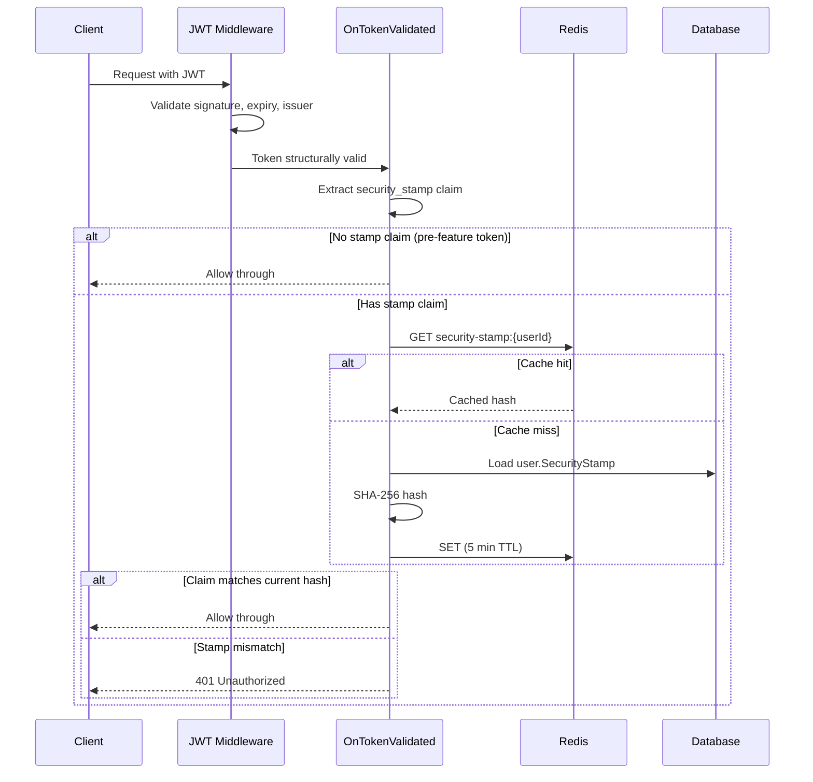
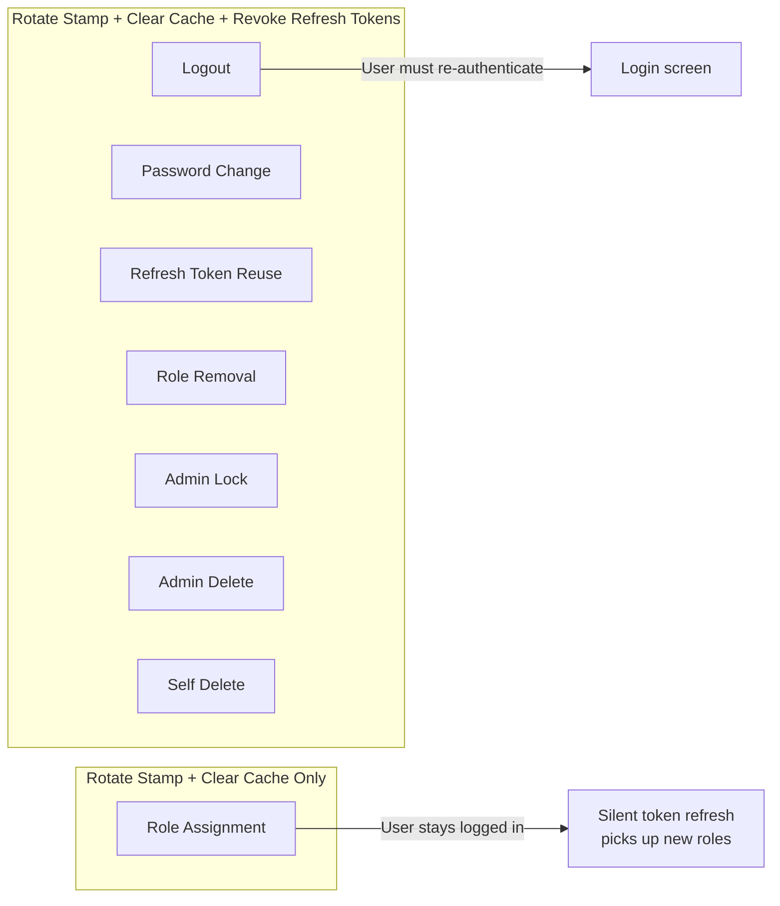

# Security Stamp JWT Validation

**Date**: 2026-02-10
**Scope**: Include hashed security stamp in JWT claims and validate on every authenticated request with Redis caching

## Summary

Added a SHA-256 hashed security stamp as a JWT claim, validated on every authenticated request via the `OnTokenValidated` JWT bearer event. Redis caches the hashed stamp with a 5-minute TTL to avoid per-request database hits. All services that rotate security stamps now invalidate the cache, ensuring password changes, role changes, and session revocations take effect within seconds rather than waiting for token expiry (up to 10 minutes).

## Changes Made

| File | Change | Reason |
|------|--------|--------|
| `Application/.../CacheKeys.cs` | Added `SecurityStamp(userId)` cache key | Redis cache key for hashed stamp lookup |
| `Infrastructure/.../JwtTokenProvider.cs` | Added `security_stamp` claim with SHA-256 hash of `SecurityStamp` | Include stamp in JWT so it can be validated per-request |
| `Infrastructure/.../ServiceCollectionExtensions.cs` | Added `OnTokenValidated` event + `ValidateSecurityStampAsync` method | Validate stamp claim against cached/DB value on every request |
| `Infrastructure/.../AuthenticationService.cs` | Injected `ICacheService`, added cache invalidation in `RevokeUserTokens` | Invalidate stamp cache on logout, password change, refresh token reuse |
| `Infrastructure/.../AdminService.cs` | Added stamp rotation + cache invalidation in `AssignRoleAsync`, added cache invalidation in `RevokeUserSessionsAsync` | Ensure role assignment and admin revocation invalidate stale tokens |
| `Infrastructure/.../UserService.cs` | Added cache invalidation in `RevokeUserTokens` | Ensure self-delete invalidates stale tokens |

## Decisions & Reasoning

### SHA-256 Hash in JWT Claim (Not Raw Stamp)

- **Choice**: Store `SHA-256(SecurityStamp)` in the JWT, not the raw value
- **Alternatives considered**: Raw stamp in claim, encrypted stamp
- **Reasoning**: The security stamp is a sensitive value used for revocation. Exposing it in a JWT (which is base64-encoded, not encrypted) would allow token holders to see the raw stamp. Hashing is a one-way operation — the claim can be compared against the DB value without leaking the actual stamp.

### Redis Cache with 5-Minute TTL

- **Choice**: Cache the hashed stamp in Redis with absolute 5-minute expiration
- **Alternatives considered**: No cache (DB hit every request), longer TTL (15–30 min), sliding expiration
- **Reasoning**: Without caching, every authenticated request would hit the database — unacceptable at scale. 5 minutes is a balance: short enough that revocation takes effect quickly (worst case 5 min if cache isn't explicitly invalidated), long enough to meaningfully reduce DB load. Absolute (not sliding) expiration ensures stale entries are evicted predictably. Explicit cache invalidation on stamp rotation means most revocations take effect immediately.

### Graceful Handling of Pre-Feature Tokens

- **Choice**: Allow tokens without the `security_stamp` claim to pass through
- **Alternatives considered**: Reject all tokens without the claim, force all users to re-authenticate on deploy
- **Reasoning**: Rolling deployment shouldn't force every user to log in again. Pre-feature tokens will naturally expire (10 min access, 7 day refresh) and be replaced with stamped tokens on next refresh. This is a temporary migration concern, not a permanent code path.

### Seamless Refresh on Role Assignment vs. Full Revoke on Role Removal

- **Choice**: Role assignment rotates the stamp + clears cache but keeps refresh tokens intact. Role removal fully revokes all sessions.
- **Alternatives considered**: Full revoke on both, seamless refresh on both
- **Reasoning**: Role assignment is additive — the user gains permissions. There's no security reason to force a logout; the user's next token refresh silently picks up the new role claims. Role removal is a restriction — you're taking away access. Stale elevated tokens shouldn't survive even for the refresh window, so full revocation (invalidate refresh tokens + force re-login) is the right call.

## Diagrams

### Security Stamp Validation Flow

### Revocation Behavior by Action

## Follow-Up Items

- [ ] Add integration tests for security stamp validation (stamp mismatch → 401)
- [ ] Add integration tests for seamless role assignment refresh flow
- [ ] Consider whether the 5-minute cache TTL needs tuning based on production traffic patterns
- [ ] Remove the pre-feature token grace period after all tokens have naturally rotated (optional — low priority, zero security risk)
