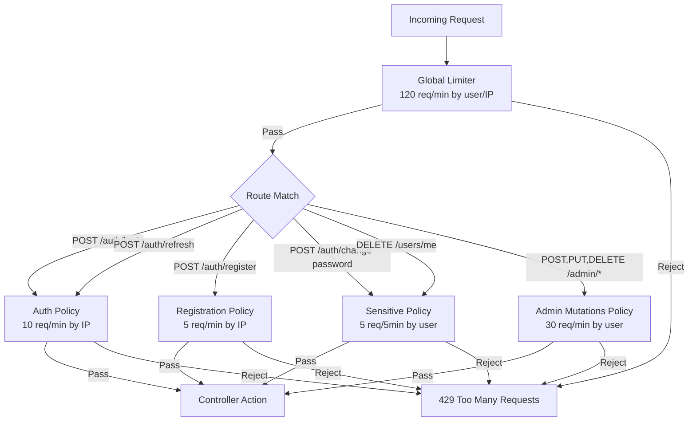

# Admin API Hardening

**Date**: 2026-02-14
**Scope**: Validation gaps, system role collision checks, path parameter constraints, and per-endpoint rate limiting across admin, auth, and user APIs

## Summary

Comprehensive security hardening pass across all API endpoints. Added system role name collision checks to prevent creating/renaming roles to reserved names. Constrained all unvalidated string path parameters via custom `IRouteConstraint` classes. Introduced three new rate limiting policies (auth, sensitive, admin-mutations) applied to every state-changing endpoint beyond the global limiter. Refactored rate limiting infrastructure for readability: flat `RateLimitPolicies` constants, deduplicated policy registration with `AddIpPolicy`/`AddUserPolicy` helpers.

## Changes Made

| File | Change | Reason |
|------|--------|--------|
| `Domain/ErrorMessages.cs` | Added `Roles.SystemRoleNameReserved` | Error message for system role name collision |
| `Infrastructure/.../RoleManagementService.cs` | Case-insensitive check against `AppRoles.All` in `CreateRoleAsync` and `UpdateRoleAsync` | Prevent creating/renaming roles to "Admin", "user", "SUPERADMIN", etc. |
| `WebApi/Routing/RoleNameRouteConstraint.cs` | New file: `IRouteConstraint` for role names (letter-start, max 50) | Clean route templates; single source of truth for role name format |
| `WebApi/Routing/JobIdRouteConstraint.cs` | New file: `IRouteConstraint` for Hangfire job IDs (alphanumeric + `._-`, max 100) | Clean route templates; single source of truth for job ID format |
| `WebApi/Program.cs` | Registered `roleName` and `jobId` custom route constraints | Enable `{role:roleName}` and `{jobId:jobId}` in route templates |
| `WebApi/.../AdminController.cs` | Route uses `{role:roleName}`; `[EnableRateLimiting(RateLimitPolicies.AdminMutations)]` on 9 endpoints | Readable constraint + dedicated rate limit for admin mutations |
| `WebApi/.../JobsController.cs` | Routes use `{jobId:jobId}`; `[EnableRateLimiting(RateLimitPolicies.AdminMutations)]` on 5 endpoints | Readable constraint + dedicated rate limit |
| `WebApi/.../AuthController.cs` | `[EnableRateLimiting(RateLimitPolicies.Auth)]` on login/refresh; `[EnableRateLimiting(RateLimitPolicies.Sensitive)]` on change-password; 429 response types | Brute-force protection + sensitive op throttling |
| `WebApi/.../UsersController.cs` | `[EnableRateLimiting(RateLimitPolicies.Sensitive)]` on delete-account; 429 response type | Irreversible operation throttling |
| `WebApi/.../RefreshRequestValidator.cs` | New file: validates `RefreshToken` max length 500 when provided | Previously no validator; unbounded string input |
| `WebApi/Shared/RateLimitPolicies.cs` | New file: flat constants for policy names (`Auth`, `Sensitive`, `AdminMutations`, `Registration`) | Short, readable `[EnableRateLimiting]` attributes |
| `WebApi/Options/RateLimitingOptions.cs` | Added `AuthLimitOptions`, `SensitiveLimitOptions`, `AdminMutationsLimitOptions`; removed `PolicyName` constants (moved to `RateLimitPolicies`) | Config classes are for options, not for attribute references |
| `WebApi/Extensions/RateLimiterExtensions.cs` | Extracted `AddIpPolicy`/`AddUserPolicy` helpers; 4 policies in 4 lines | Eliminated copy-paste; adding a 6th policy is one line |
| `appsettings.json` | Added `Auth`, `Sensitive`, `AdminMutations` sections | Production rate limit defaults |
| `appsettings.Development.json` | Added same sections with relaxed limits | Dev-friendly limits (300 req/10s) |
| `SKILLS.md` | Added "Add a Rate Limit Policy" and "Add a Route Constraint" recipes | Discoverable patterns for future work |
| `FILEMAP.md` | Added impact rows for `RateLimitPolicies`, `RateLimitingOptions`, route constraints; updated `AppRoles.cs` impact | Complete change traceability |

## Decisions & Reasoning

### Three separate rate limit policies instead of one

- **Choice**: Separate `auth` (by IP), `sensitive` (by user), and `admin-mutations` (by user) policies
- **Alternatives considered**: Single "strict" policy for all non-GET endpoints; two policies (auth + everything else)
- **Reasoning**: Different threat models require different partitioning strategies. Auth endpoints are unauthenticated (partition by IP to stop brute-force). Sensitive user ops are authenticated (partition by user to prevent abuse). Admin mutations are already behind permission checks but need throughput limits against compromised admin accounts.

### Custom IRouteConstraint vs inline regex

- **Choice**: Dedicated `RoleNameRouteConstraint` and `JobIdRouteConstraint` classes registered in `Program.cs`
- **Alternatives considered**: Inline `regex(...)` + `maxlength(...)` in route templates; custom `IActionFilter`
- **Reasoning**: Inline regex with doubled brackets (`[[A-Za-z]]`) is unreadable and duplicated across routes. Custom constraints give readable templates (`{role:roleName}`), compile-time regex via `[GeneratedRegex]`, and a single place to update the pattern. Action filters would run too late (after model binding).

### Flat RateLimitPolicies class

- **Choice**: Static `RateLimitPolicies` class with flat string constants; no `PolicyName` on options classes
- **Alternatives considered**: Keep `PolicyName` on each options subclass (e.g. `RateLimitingOptions.AdminMutationsLimitOptions.PolicyName`)
- **Reasoning**: Policy names are referenced from controller attributes — readability at the usage site matters most. `[EnableRateLimiting(RateLimitPolicies.AdminMutations)]` is instantly scannable. The options classes are for configuration binding, not for controller attribute references.

### Deduplicated AddIpPolicy / AddUserPolicy helpers

- **Choice**: Two generic helpers that differ only in partition-key strategy (IP vs user identity)
- **Alternatives considered**: Keep per-policy methods (e.g. `AddRegistrationPolicy`, `AddAuthPolicy`, etc.)
- **Reasoning**: The per-policy methods were structurally identical 15-line blocks. The two helpers capture the only meaningful difference (partition strategy) and reduce adding a new policy to a single line.

### RefreshToken max length 500

- **Choice**: 500-character limit on refresh token body parameter
- **Alternatives considered**: No limit (trust backend validation), stricter limit (256)
- **Reasoning**: Refresh tokens in this system are 64-byte random values base64-encoded (~88 chars), but allowing headroom for format changes. 500 is generous enough to never break legitimate tokens while preventing multi-megabyte payloads.

## Diagrams

### ProducesResponseType: per-action, never class-level

- **Choice**: All `[ProducesResponseType]` attributes go on individual actions, never on the controller or base class — even when multiple actions share a status code
- **Alternatives considered**: Class-level `[ProducesResponseType(429)]` on `ApiController` since the global rate limiter applies to all endpoints
- **Reasoning**: Class-level placement silently applies to every action, including ones that don't need it. This creates noise in the OpenAPI spec and misleading generated TypeScript types. Per-action placement keeps each endpoint's OAS entry self-contained and precise — you can read a single action and know exactly what it can return. Concrete example: 429 only goes on endpoints with `[EnableRateLimiting]`, not on the base class just because the global limiter exists. Same logic applies to 401, 403, 404, etc.

## Follow-Up Items

- [ ] Consider adding rate limiting to the `POST /auth/logout` endpoint (low priority since it requires authentication and is idempotent)
- [ ] Monitor production rate limit hit rates via Seq to tune thresholds
- [ ] Consider sliding window instead of fixed window for auth policy to prevent burst timing attacks at window boundaries
