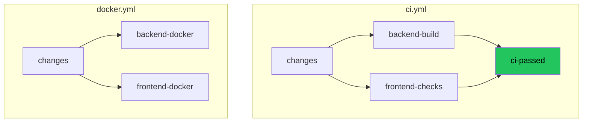

# GitHub Actions CI Pipelines

**Date**: 2026-02-14
**Scope**: Add CI, Docker validation, and Dependabot workflows

## Summary

Added three GitHub Actions configurations: a main CI pipeline that enforces build/lint/type-check on every PR, a Docker build validation workflow, and Dependabot for automated dependency updates. The CI uses a single-pipeline architecture with path-filtered jobs and a gate job pattern for branch protection.

## Changes Made

| File | Change | Reason |
|------|--------|--------|
| `.github/workflows/ci.yml` | Created main CI pipeline | Enforce build + lint + type-check on PRs and pushes to master |
| `.github/workflows/docker.yml` | Created Docker build validation | Catch broken images before merge, with GHA layer cache |
| `.github/dependabot.yml` | Created Dependabot config | Automated weekly dependency updates with grouping |
| `AGENTS.md` | Replaced "No GitHub Actions" paragraph with workflow docs | Document the new CI/CD setup |
| `FILEMAP.md` | Added CI workflows row to cross-stack changes table | Track path-filter maintenance as a cross-cutting concern |

## Decisions & Reasoning

### Single pipeline vs. split workflows

- **Choice**: Single `ci.yml` with path-filtered jobs and a gate job
- **Alternatives considered**: Separate `ci-backend.yml` and `ci-frontend.yml` workflows
- **Reasoning**: The gate job pattern (`ci-passed`) gives a single required check in branch protection — set once, never touched again. Adding a new frontend (React Native, Swift, etc.) means editing one file (add path filter + job + update gate `needs`), not creating a new workflow file AND updating branch protection settings. The single `dorny/paths-filter` run also avoids spinning up redundant runners per workflow. The template is designed for pluggable frontends, and this pattern scales cleanly — each new project area is ~20 lines of YAML added to an existing file.

### `dorny/paths-filter` vs. `on.paths`

- **Choice**: `dorny/paths-filter` for CI, `on.paths` for Docker
- **Alternatives considered**: `on.paths` everywhere, or `dorny/paths-filter` everywhere
- **Reasoning**: CI needs `dorny/paths-filter` because the gate job must always produce a status check — `on.paths` would skip the entire workflow, leaving the required check missing and blocking the PR. Docker validation is not a required check, so `on.paths` is fine and avoids the overhead of a `changes` job.

### Dependabot grouping strategy

- **Choice**: Group minor+patch updates; individual PRs for major versions
- **Alternatives considered**: No grouping (one PR per dependency), group everything
- **Reasoning**: Minor+patch updates are low-risk and create noise when ungrouped. Major versions need individual attention for breaking changes. Weekly on Monday keeps updates predictable.

## Diagrams

## Follow-Up Items

- [ ] Add test steps when test projects are created (placeholders are commented out)
- [ ] Configure branch protection to require `CI passed` status check
- [ ] Consider code coverage uploads when test infrastructure exists
