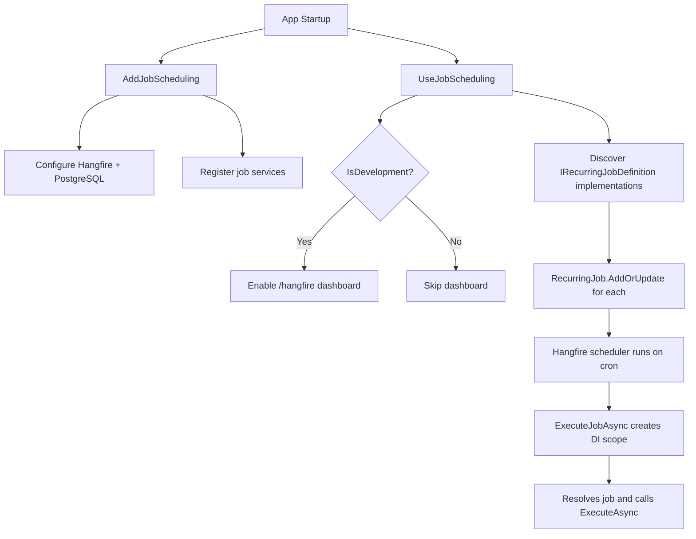

# Hangfire Job Scheduling Infrastructure

**Date**: 2026-02-14
**Scope**: Background job scheduling with Hangfire, admin UI, and expired refresh token cleanup

## Summary

Introduced Hangfire with PostgreSQL persistence as the standardized background job framework. Created a `IRecurringJobDefinition` interface for writing jobs in a consistent way, implemented the expired refresh token cleanup as the first job (#56), and built a full admin UI for job management with permission-based access control.

## Changes Made

| File | Change | Reason |
|------|--------|--------|
| `Directory.Packages.props` | Added Hangfire.Core 1.8.23, Hangfire.AspNetCore 1.8.23, Hangfire.PostgreSql 1.20.13 | NuGet package management |
| `MyProject.Infrastructure.csproj` | Added Hangfire.AspNetCore, Hangfire.Core, Hangfire.PostgreSql references | Infrastructure needs Hangfire for DI + dashboard |
| `MyProject.WebApi.csproj` | Added Hangfire.AspNetCore reference | WebApi needs Hangfire middleware |
| `AppPermissions.cs` | Added `Jobs.View` and `Jobs.Manage` permissions | Permission-based access to job admin |
| `ErrorMessages.cs` | Added `Jobs.NotFound` and `Jobs.TriggerFailed` | Consistent error messages for job operations |
| `IRecurringJobDefinition.cs` | Created standardized interface for recurring jobs | Convention for writing jobs consistently |
| `ExpiredRefreshTokenCleanupJob.cs` | Created first recurring job | Closes #56 — cleanup expired refresh tokens hourly |
| `IJobManagementService.cs` + DTOs | Created Application layer interface and DTOs | Clean Architecture — controller depends on abstraction |
| `JobManagementService.cs` | Created Hangfire monitoring/management service | Implements admin operations (list, detail, trigger, pause, resume, delete) |
| `JobSchedulingOptions.cs` | Created options class with `Enabled` and `WorkerCount` | Configurable via `appsettings.json` (`JobScheduling` section) |
| `ServiceCollectionExtensions.cs` (Jobs) | Created DI registration for Hangfire + services | Follows existing extension method pattern; skips Hangfire when disabled |
| `ApplicationBuilderExtensions.cs` (Jobs) | Created middleware + job registration | Hangfire dashboard (dev) + auto-discovers `IRecurringJobDefinition`; skips when disabled |
| `appsettings.json` | Added `JobScheduling` section | `Enabled: true`, `WorkerCount: 4` defaults |
| `JobsController.cs` | Created admin API endpoints at `api/v1/admin/jobs` | 6 endpoints: list, detail, trigger, delete, pause, resume |
| `JobsMapper.cs` + response DTOs | Created WebApi layer mapping | Follows existing mapper pattern |
| `Program.cs` | Wired up `AddJobScheduling()` and `UseJobScheduling()` | Entry point for Hangfire |
| `permissions.ts` | Added `Jobs.View` and `Jobs.Manage` | Frontend permission constants mirror backend |
| `+layout.server.ts` (admin) | Added `Jobs.View` to admin access check | Users with only job permissions can access admin |
| `SidebarNav.svelte` | Added Jobs nav item with Clock icon | Admin navigation |
| `en.json` / `cs.json` | Added ~40 i18n keys for jobs | Full localization support |
| Job components (4 files) | `JobTable`, `JobInfoCard`, `JobActionsCard`, `JobExecutionHistory` | Reusable admin UI components |
| Job pages (4 files) | List page + detail page with server loaders | `/admin/jobs` and `/admin/jobs/[jobId]` |
| `admin/index.ts` | Exported new job components | Barrel export pattern |
| `ExampleFireAndForgetJob.cs` | Example one-time background job (removable) | Demonstrates `IBackgroundJobClient` pattern for template users |
| `SKILLS.md` | Added "Add a Background Job" and "Fire a One-Time Background Job" recipes | Step-by-step guides for template users |
| `FILEMAP.md` | Added job scheduling patterns + impact rules | Change tracking for job-related files |

## Decisions & Reasoning

### Hangfire over raw BackgroundService

- **Choice**: Hangfire with PostgreSQL storage
- **Alternatives considered**: Raw `BackgroundService`, Quartz.NET, custom scheduler
- **Reasoning**: Hangfire provides persistence, retry logic, a built-in dashboard (dev), and a monitoring API out of the box. Free LGPL tier is sufficient. Using the same PostgreSQL database eliminates additional infrastructure.

### IRecurringJobDefinition Interface

- **Choice**: Created a custom `IRecurringJobDefinition` interface in Infrastructure layer
- **Alternatives considered**: Using Hangfire's raw `RecurringJob.AddOrUpdate<T>()` API directly, attribute-based registration
- **Reasoning**: Hangfire doesn't prescribe a convention for organizing jobs. The interface provides a standardized contract (JobId, CronExpression, ExecuteAsync), enables auto-discovery at startup, and gives template users a clear pattern to follow. Each job is self-describing.

### Separate JobsController (not in AdminController)

- **Choice**: New `JobsController` with `[Route("api/v1/admin")]` override
- **Alternatives considered**: Adding job endpoints to existing `AdminController`
- **Reasoning**: `AdminController` is already large (~300 lines). Separate controller keeps file sizes manageable while maintaining the same route prefix via the `[Route]` attribute.

### Pause/Resume via Cron Manipulation

- **Choice**: Set cron to "0 0 31 2 *" (Feb 31, never fires) on pause, restore original on resume
- **Alternatives considered**: Hangfire Pro pause API (paid), deleting and re-creating jobs
- **Reasoning**: Hangfire free tier has no native pause/resume. The "never cron" approach keeps the job entry visible in the dashboard while preventing execution. Original cron is stored in a `ConcurrentDictionary` — simple and thread-safe for the single-server template use case.
- **Restore interaction**: If a job is removed via the API, its pause record is cleaned up — restore brings it back running. If deleted directly from the Hangfire dashboard, the pause record survives — restore re-registers it still paused.

### Fire-and-Forget: No Custom Interface

- **Choice**: Use Hangfire's built-in `IBackgroundJobClient` directly for one-time jobs
- **Alternatives considered**: Custom `IFireAndForgetJobDefinition` interface mirroring `IRecurringJobDefinition`
- **Reasoning**: Fire-and-forget jobs are ad-hoc — they're enqueued on demand, not registered at startup. A custom interface would add ceremony without value. `IBackgroundJobClient` is already injectable, testable, and handles DI scoping. An example class (`ExampleFireAndForgetJob`) demonstrates the pattern.

### DI Scope per Execution

- **Choice**: Each job execution resolves from a fresh `IServiceScope`
- **Alternatives considered**: Static job methods, constructor-injected singletons
- **Reasoning**: Background jobs must not share scoped services (like DbContext) with HTTP requests. The `ExecuteJobAsync` wrapper creates a new scope per execution, matching how ASP.NET Core handles request scopes.

## Diagrams

```mermaid
classDiagram
    class IRecurringJobDefinition {
        <<interface>>
        +string JobId
        +string CronExpression
        +ExecuteAsync() Task
    }

    class ExpiredRefreshTokenCleanupJob {
        -MyProjectDbContext dbContext
        -TimeProvider timeProvider
        -ILogger logger
        +JobId = "expired-refresh-token-cleanup"
        +CronExpression = Cron.Hourly()
        +ExecuteAsync() Task
    }

    class IJobManagementService {
        <<interface>>
        +GetRecurringJobsAsync()
        +GetRecurringJobDetailAsync(jobId)
        +TriggerJobAsync(jobId)
        +RemoveJobAsync(jobId)
        +PauseJobAsync(jobId)
        +ResumeJobAsync(jobId)
    }

    class JobManagementService {
        -PausedJobCrons: ConcurrentDictionary
        +GetRecurringJobsAsync()
        +TriggerJobAsync(jobId)
        +PauseJobAsync(jobId)
    }

    class JobsController {
        +GET /api/v1/admin/jobs
        +GET /api/v1/admin/jobs/{jobId}
        +POST /api/v1/admin/jobs/{jobId}/trigger
        +DELETE /api/v1/admin/jobs/{jobId}
        +POST /api/v1/admin/jobs/{jobId}/pause
        +POST /api/v1/admin/jobs/{jobId}/resume
    }

    IRecurringJobDefinition <|.. ExpiredRefreshTokenCleanupJob
    IJobManagementService <|.. JobManagementService
    JobsController --> IJobManagementService
```



## Follow-Up Items

- [ ] Run `npm run api:generate` after starting the backend to regenerate `v1.d.ts` with new job endpoints
- [ ] Verify Hangfire auto-creates `hangfire.*` schema in PostgreSQL on first startup
- [ ] Assign `jobs.view` and `jobs.manage` permissions to Admin role via the permissions UI
- [ ] Consider adding more recurring jobs as the application grows (e.g., email queue processing, cache warming, audit log archival)
- [x] ~~If scaling to multiple servers, replace the in-memory `PausedJobCrons` dictionary with a persistent store (database or Hangfire job parameters)~~ — Pause state now persisted to `hangfire.pausedjobs` table; dictionary serves as read cache
- [x] ~~Add a "restore jobs" admin endpoint (`POST /api/v1/admin/jobs/restore`) that re-registers all `IRecurringJobDefinition` implementations without requiring an app restart~~ — Implemented with permission gate + frontend button
- [x] ~~Newtonsoft.Json NU1903 vulnerability warning~~ — Pinned Newtonsoft.Json 13.0.3 in `Directory.Packages.props` to override Hangfire's transitive 11.0.1 dependency. Hangfire is the only consumer; application code must use `System.Text.Json` exclusively
- [x] ~~Review fixes~~ — Removed dead `NoOp()` method (pause now uses `ExecuteJobAsync` consistently), fixed `ResumeJobAsync` to delete from DB before removing from dictionary (crash-safe ordering), extracted `common_cancel`/`common_delete` i18n keys to replace cross-context reuse of `admin_userDetail_*` keys
