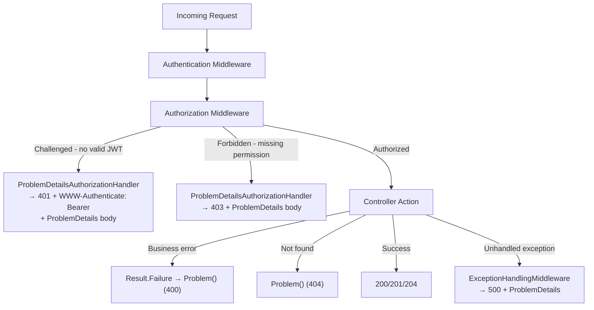

# OpenAPI Specification Audit

**Date**: 2026-02-14
**Scope**: Comprehensive audit of the OpenAPI/OAS setup, fixing spec accuracy issues

## Summary

Audited the full OpenAPI specification setup — document transformers, operation transformers, schema transformers, controller annotations, and Scalar UI configuration. Identified 6 issues, fixed 5 (the 3 original plus 2 discovered during review), and evaluated the remaining 3 as not worth fixing. Also made the runtime match the spec by ensuring all 401/403 responses return `ErrorResponse` JSON bodies. Discovered late that `[ApiController]`'s `ProblemDetails` convention was silently overriding all error type annotations — fixed with `SuppressMapClientErrors` + `[ProducesErrorResponseType]` and cleaned up all controllers to use the centralized pattern.

## Changes Made

| File | Change | Reason |
|------|--------|--------|
| `WebApi/Features/OpenApi/Transformers/BearerSecurityOperationTransformer.cs` | New operation transformer that applies `bearerAuth` security requirement to `[Authorize]` endpoints | Security scheme was defined in the spec but never applied to operations — clients couldn't see which endpoints require auth |
| `WebApi/Features/OpenApi/Extensions/WebApplicationBuilderExtensions.cs` | Registered `BearerSecurityOperationTransformer` | Wire up the new transformer |
| `WebApi/Features/Admin/AdminController.cs` | Added `[Tags("Admin")]`; error `ProducesResponseType` cleaned to untyped (inherits from `ApiController`) | Endpoints grouped under "Admin" tag; error types via `ProducesErrorResponseType` |
| `WebApi/Features/Admin/JobsController.cs` | Added `[Tags("Jobs")]`; error `ProducesResponseType` cleaned to untyped (inherits from `ApiController`) | Same; grouped under "Jobs" tag |
| `WebApi/Features/Users/UsersController.cs` | Added `[Tags("Users")]`, `[ProducesErrorResponseType(typeof(ErrorResponse))]`; error `ProducesResponseType` cleaned to untyped | Same; grouped under "Users" tag |
| `WebApi/Features/Authentication/AuthController.cs` | Added `[Tags("Auth")]`, `[ProducesErrorResponseType(typeof(ErrorResponse))]`; error `ProducesResponseType` cleaned to untyped | Same; grouped under "Auth" tag |

## Decisions & Reasoning

### Fix 1: Apply bearerAuth via operation transformer

- **Choice**: Created a dedicated `IOpenApiOperationTransformer` that inspects `[Authorize]` / `[AllowAnonymous]` metadata
- **Alternatives considered**: (a) Global security requirement on the document, (b) Per-endpoint `[OpenApiSecurity]` attributes
- **Reasoning**: Global security would mark anonymous endpoints (login, register, refresh) as requiring auth. Per-endpoint attributes would be verbose and error-prone. The transformer automatically detects authorization metadata, so new endpoints get correct security annotations without manual work.

### Fix 2: ErrorResponse as default error type

- **Choice**: Initially added `typeof(ErrorResponse)` to individual `ProducesResponseType` attributes. Later replaced by `[ProducesErrorResponseType(typeof(ErrorResponse))]` on base controllers + `SuppressMapClientErrors = true` (see Fix 6).
- **Reasoning**: All controllers return `ErrorResponse` at runtime. Centralizing the error type on the controller class is cleaner than repeating it on every endpoint. The individual `typeof(ErrorResponse)` approach was also silently overridden by `[ApiController]`'s ProblemDetails convention (discovered in Fix 6).

### Fix 3: Explicit Tags on controllers

- **Choice**: Added `[Tags("Admin")]`, `[Tags("Jobs")]`, `[Tags("Users")]`, `[Tags("Auth")]` to each controller
- **Alternatives considered**: Relying on ASP.NET's auto-generated tags from controller names
- **Reasoning**: Explicit tags ensure stable, predictable grouping in Scalar UI regardless of controller naming changes. `JobsController` shares the `api/v1/admin` route prefix with `AdminController` — without explicit tags, both would auto-tag as "Admin", merging their operations.

### Items evaluated but not fixed

- **Rate limit values in spec (item 4)**: Adding concrete numbers (e.g., "10 requests per minute") to the OpenAPI spec would couple the spec to runtime configuration. The `429` response is already documented, and `Retry-After` headers tell clients when to retry. Not worth the maintenance burden.
- **`useCookies` query parameter description (item 5)**: Already handled by `CamelCaseQueryParameterTransformer` which propagates schema descriptions to parameters. Low priority.
- **`Set-Cookie` response headers (item 6)**: Documenting `Set-Cookie` headers in OpenAPI requires complex header schema definitions for marginal value — web clients handle cookies automatically and don't need to parse them from the spec. Not worth the complexity.

### Fix 4: ErrorResponse body on middleware-level 401/403

- **Problem**: The OpenAPI spec (after Fix 2) claims all 401/403 responses return `ErrorResponse`, but middleware-level auth failures (missing/expired JWT, insufficient permissions) returned empty bodies. Only controller-level returns (login, refresh) included the body.
- **Choice**: Created `ErrorResponseAuthorizationMiddlewareResultHandler` implementing `IAuthorizationMiddlewareResultHandler`
- **Alternatives considered**: (a) JWT `OnChallenge`/`OnForbidden` event handlers, (b) Custom middleware before `UseAuthorization()`
- **Reasoning**: `IAuthorizationMiddlewareResultHandler` is ASP.NET Core's dedicated extension point for customizing authorization results. It handles both 401 (challenged) and 403 (forbidden) in a single class, lives cleanly in the WebApi layer alongside `ErrorResponse`, and doesn't require fragile `PostConfigure<JwtBearerOptions>` wiring. Added `ErrorMessages.Auth.InsufficientPermissions` constant for the 403 message; reused existing `ErrorMessages.Auth.NotAuthenticated` for 401.

| File | Change | Reason |
|------|--------|--------|
| `Domain/ErrorMessages.cs` | Added `Auth.InsufficientPermissions` constant | Consistent error message for 403 responses |
| `WebApi/Authorization/ErrorResponseAuthorizationMiddlewareResultHandler.cs` | New `IAuthorizationMiddlewareResultHandler` implementation | Returns `ErrorResponse` JSON for both 401 and 403 |
| `WebApi/Program.cs` | Registered handler in DI | Wire up the new handler |

### Fix 5: Typed 404 responses and WWW-Authenticate header

- **Problem**: All 15 `[ProducesResponseType(StatusCodes.Status404NotFound)]` attributes in `AdminController` (10) and `JobsController` (5) were untyped, but controllers return `NotFound(new ErrorResponse{...})` at runtime. Also, the new auth handler was missing the `WWW-Authenticate: Bearer` header on 401 per RFC 6750.
- **Choice**: Added `typeof(ErrorResponse)` to all 404 attributes; added `WWW-Authenticate: Bearer` header to the challenge path.
- **Reasoning**: Completes the "every error returns `ErrorResponse`" guarantee. The `WWW-Authenticate` header is required by RFC 6750 §3 for Bearer-authenticated APIs.

### Housekeeping: Untrack inlang-managed files

Inlang v2.5+ auto-generates `.gitignore`, `.meta.json`, `README.md`, and `project_id` inside `project.inlang/`. These were showing up as dirty/untracked. Untracked `.gitignore` and `project_id` from git and replaced the gitignore with `*` / `!settings.json` so only the settings file is version-controlled.

## Diagrams

### Fix 6: SuppressMapClientErrors + ProducesErrorResponseType (spec accuracy)

- **Problem**: After Fixes 1–5, `npm run api:generate` produced no diff. Fetching the live OAS JSON at `/openapi/v1.json` revealed all 401/403/404 responses still referenced `ProblemDetails`, not `ErrorResponse`. The `[ProducesResponseType(typeof(ErrorResponse), ...)]` annotations were being **silently overridden** by `[ApiController]`'s built-in "Problem details for error status codes" convention, which maps all 4xx to `ProblemDetails` in the OAS metadata.
- **Root cause**: `[ApiController]` enables `ClientErrorMapping` by default, which replaces the type in any `ProducesResponseType` for 4xx status codes with `ProblemDetails`. Only non-error codes (200, 201, 204) and codes without the `[ApiController]` convention (e.g., 400 returned via `ValidationProblem`) were unaffected.
- **Choice**: Two-part fix:
  1. `SuppressMapClientErrors = true` in `ConfigureApiBehaviorOptions` → disables the `ProblemDetails` override
  2. `[ProducesErrorResponseType(typeof(ErrorResponse))]` on `ApiController` (base), `AuthController`, and `UsersController` → sets the default error response type for all error status codes
- **Cleanup**: Removed all `typeof(ErrorResponse)` from individual `[ProducesResponseType]` error attributes across all 4 controllers (AdminController, JobsController, AuthController, UsersController). Error status codes now inherit the type from the controller-level `ProducesErrorResponseType`.
- **Security transformer fix**: `BearerSecurityOperationTransformer` was also not working — `EndpointMetadata` doesn't include `[Authorize]` inherited from base controllers. Rewrote to use `ControllerActionDescriptor` reflection with `inherit: true`.

| File | Change | Reason |
|------|--------|--------|
| `WebApi/Program.cs` | Added `SuppressMapClientErrors = true` | Prevent `[ApiController]` from overriding error types with `ProblemDetails` |
| `WebApi/Shared/ApiController.cs` | Added `[ProducesErrorResponseType(typeof(ErrorResponse))]` | Default error type for all endpoints inheriting from base controller |
| `WebApi/Features/Authentication/AuthController.cs` | Added `[ProducesErrorResponseType(typeof(ErrorResponse))]`; removed `typeof(ErrorResponse)` from all error `ProducesResponseType` | Centralized error type; clean annotations |
| `WebApi/Features/Users/UsersController.cs` | Added `[ProducesErrorResponseType(typeof(ErrorResponse))]`; removed `typeof(ErrorResponse)` from all error `ProducesResponseType` | Same |
| `WebApi/Features/Admin/AdminController.cs` | Removed `typeof(ErrorResponse)` from all error `ProducesResponseType` | Inherits from `ApiController` |
| `WebApi/Features/Admin/JobsController.cs` | Removed `typeof(ErrorResponse)` from all error `ProducesResponseType` | Same |
| `WebApi/Features/OpenApi/Transformers/BearerSecurityOperationTransformer.cs` | Use `ControllerActionDescriptor` reflection with `inherit: true` | `EndpointMetadata` doesn't include inherited `[Authorize]` from base classes |
| `AGENTS.md` | Updated ProducesResponseType guidance, OAS checklist | Document new `ProducesErrorResponseType` pattern |

## Follow-Up: ProblemDetails Migration (RFC 9457)

Replaced `ErrorResponse { Message, Details }` with standard `ProblemDetails` across the entire API. This removed the need for `SuppressMapClientErrors`, `[ProducesErrorResponseType]`, custom JSON serialization options, and aligned with what ASP.NET Core natively does.

### Changes

| Area | Change |
|------|--------|
| `Program.cs` | Added `AddProblemDetails()` with `CustomizeProblemDetails`; removed `SuppressMapClientErrors`; handler → `ProblemDetailsAuthorizationHandler` |
| `ExceptionHandlingMiddleware` | Returns `ProblemDetails` with `application/problem+json`; stack trace in `extensions.stackTrace` (dev only) |
| Auth handler | Deleted `ErrorResponseAuthorizationMiddlewareResultHandler`, created `ProblemDetailsAuthorizationHandler` |
| `RateLimiterExtensions` | 429 returns `ProblemDetails` |
| `ApiController` | Removed `[ProducesErrorResponseType(typeof(ErrorResponse))]` |
| All 4 controllers | `new ErrorResponse { Message = ... }` → `Problem(detail: ..., statusCode: ...)` |
| `ErrorResponse.cs` | Deleted |
| Frontend `error-handling.ts` | Removed `message` field check; resolution: `detail` → `title` → fallback |
| Frontend proxy | CSRF/503 responses return ProblemDetails shape |
| Docs | Updated CLAUDE.md, AGENTS.md (x2), FILEMAP.md, SKILLS.md |

### Reasoning

- `ErrorResponse` fought the framework — ASP.NET Core wants to return `ProblemDetails` for all client errors
- FluentValidation already returned `ValidationProblemDetails`, creating two different error shapes
- `ProblemDetails` is an RFC standard (9457), has `[JsonPropertyName]` attributes, and removes the need for custom JSON options
- Nobody is using this template yet — cleanest time to switch

### Fix 7: Set HTTP status code before `IProblemDetailsService.WriteAsync()`

- **Problem**: After the ProblemDetails migration (Fix 6 follow-up), all middleware-level error responses returned HTTP `200 OK` with a ProblemDetails body containing the correct `status` field (e.g., `401`). HTTP clients, proxies, and API gateways check the HTTP status code — not the JSON body — making this a breaking change.
- **Root cause**: The refactoring replaced explicit `context.Response.StatusCode = ...` + `WriteAsJsonAsync(...)` with `IProblemDetailsService.WriteAsync(...)`, assuming the service would propagate `ProblemDetails.Status` to `Response.StatusCode`. It does not — it only writes the JSON body.
- **Affected code paths**: All middleware-level error responses (401 Unauthorized, 403 Forbidden, 429 Too Many Requests, and all exception-mapped codes: 400, 404, 500).
- **Fix**: Added explicit `Response.StatusCode` assignment before every `WriteAsync()` call.

| File | Change | Reason |
|------|--------|--------|
| `WebApi/Authorization/ProblemDetailsAuthorizationHandler.cs` | Added `StatusCode = 401` and `StatusCode = 403` before `WriteAsync()` | Auth failures were returning 200 |
| `WebApi/Middlewares/ExceptionHandlingMiddleware.cs` | Added `StatusCode = status` before `WriteAsync()` | Exception responses were returning 200 |
| `WebApi/Extensions/RateLimiterExtensions.cs` | Added `StatusCode = 429` before `WriteAsync()` | Rate limit rejections were returning 200 |
| `AGENTS.md` | Updated `WriteAsync()` code example to include `Response.StatusCode` and a warning | Prevent future developers from reproducing the bug |

### Fix 8: Harden exception middleware and add `UseStatusCodePages()` safety net

- **Problem 1**: `ExceptionHandlingMiddleware` used `exception.Message` directly for `KeyNotFoundException`, which could leak internal details (DB table names, IDs) if a future developer throws `KeyNotFoundException` with a message containing sensitive information.
- **Fix**: Use `ErrorMessages.Entity.NotFound` as a safe generic message, matching the pattern already used for 500 errors.
- **Problem 2**: Edge-case status codes not covered by any custom handler (e.g., routing 404, 405 Method Not Allowed, 406 Not Acceptable) returned empty bodies.
- **Fix**: Added `app.UseStatusCodePages()` after `ExceptionHandlingMiddleware` in the middleware pipeline. With `AddProblemDetails()` registered, this automatically generates ProblemDetails for any error status code that reaches the client without a body.
- **Docs**: Updated AGENTS.md to explicitly warn against using `NotFound()`, `BadRequest()`, `Unauthorized()` shorthand helpers — always use `Problem(detail: ..., statusCode: ...)` instead.

| File | Change | Reason |
|------|--------|--------|
| `WebApi/Middlewares/ExceptionHandlingMiddleware.cs` | Use `ErrorMessages.Entity.NotFound` for `KeyNotFoundException` | Prevent leaking exception messages to clients |
| `WebApi/Program.cs` | Added `app.UseStatusCodePages()` | Catch-all ProblemDetails for uncovered error status codes |
| `AGENTS.md` | Explicit rule against `NotFound()`, `BadRequest()`, `Unauthorized()` helpers | Ensure consistent ProblemDetails responses |
| Session notes | Updated Mermaid diagram to reference `ProblemDetails` instead of `ErrorResponse` | Diagram showed stale intermediate state |

## Remaining Items

- [x] ~~Regenerate frontend API types (`npm run api:generate`) after merging~~ — done, `v1.d.ts` updated
- [ ] Update 4 XML doc comments in `JobsController` that are missing `/// <response code="400">` entries (low priority — attributes are correct, only comments are incomplete)
