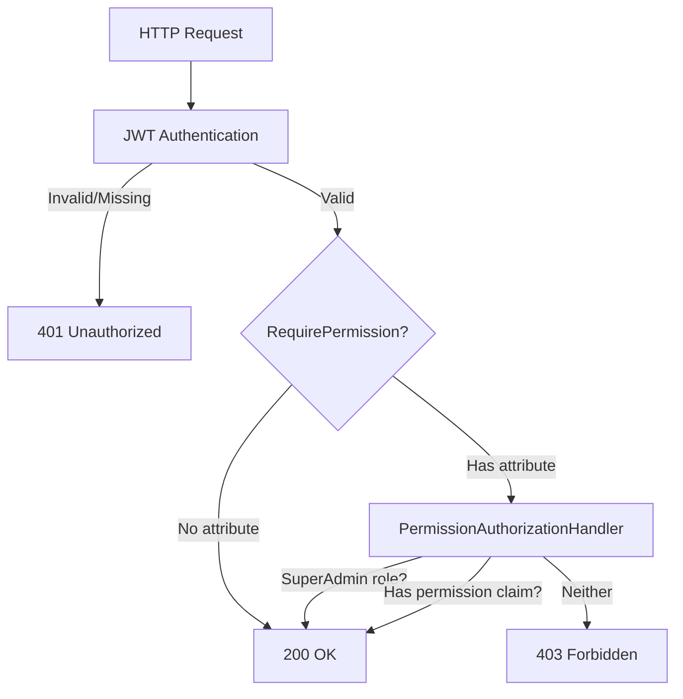
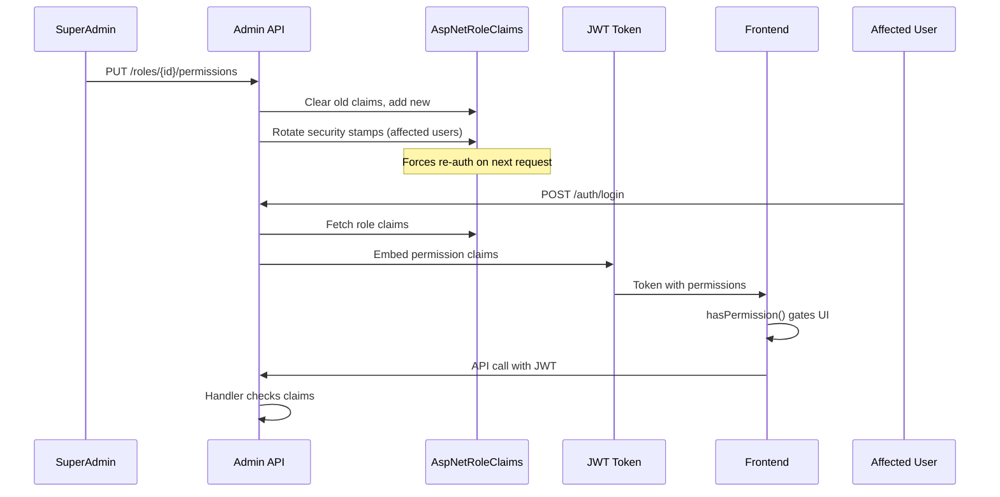
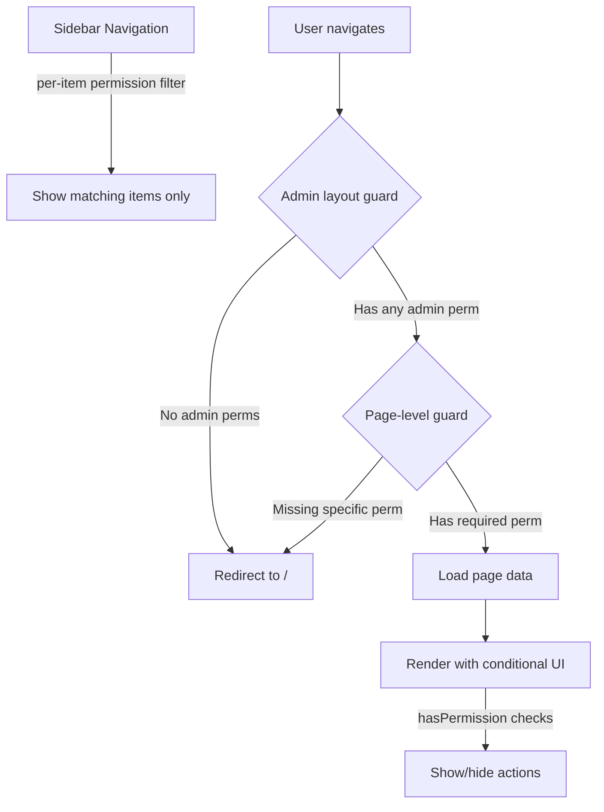
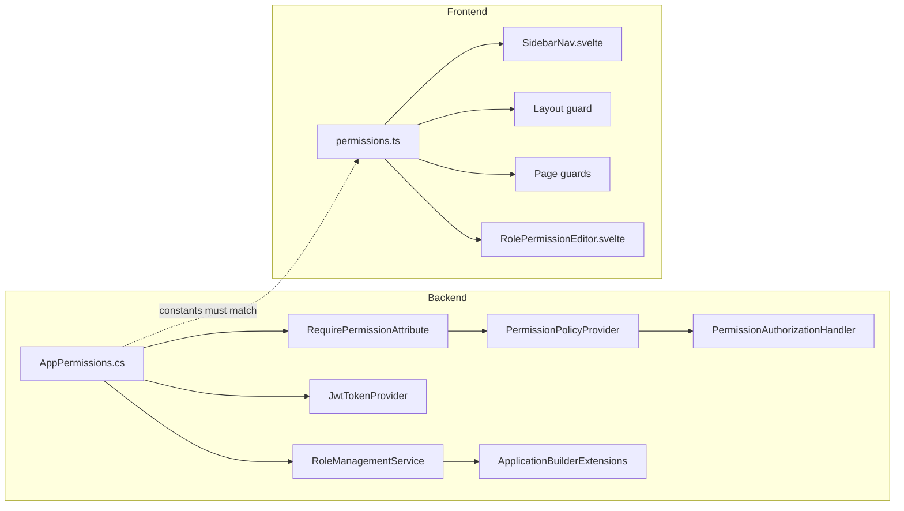

# Permission-Based Authorization System

**Date**: 2026-02-13 to 2026-02-14
**Scope**: Replace role-based `[Authorize(Roles)]` with granular permission-based authorization across backend and frontend

## Summary

Introduced an atomic permission system where SuperAdmin has implicit all permissions, default roles (SuperAdmin, Admin, User) have configurable permission sets, and custom roles act as permission bundles. The backend uses `[RequirePermission]` attributes with a dynamic `IAuthorizationPolicyProvider`, permissions are embedded in JWTs, and the frontend gates both navigation items and page access per individual permission. A full role management CRUD was added for SuperAdmin to create/edit/delete custom roles and assign permissions.

## How the Permission System Works

### Core Concept

**Permissions grow with the codebase; roles grow with the organization.**

Permissions are code-defined constants tied to specific enforcement points (`[RequirePermission]` on endpoints). Roles are runtime-configurable bundles of those permissions. A permission that no attribute checks for is meaningless, so every permission must have:

1. A constant in `AppPermissions.cs` (backend)
2. A `[RequirePermission]` attribute on at least one endpoint
3. A matching constant in `permissions.ts` (frontend)

This prevents orphaned permissions and ensures every permission maps to an actual enforcement point.

### Permission Constants

Backend (`AppPermissions.cs`):

```csharp
public static class Users
{
    public const string View = "users.view";
    public const string Manage = "users.manage";
    public const string AssignRoles = "users.assign_roles";
}

public static class Roles
{
    public const string View = "roles.view";
    public const string Manage = "roles.manage";
}
```

Frontend (`permissions.ts`):

```typescript
export const Permissions = {
    Users: { View: 'users.view', Manage: 'users.manage', AssignRoles: 'users.assign_roles' },
    Roles: { View: 'roles.view', Manage: 'roles.manage' }
} as const;
```

The `AppPermissions.All` collection is discovered via reflection — adding a new `public const string` field inside a nested static class is automatically picked up. The `ByCategory` dictionary groups permissions by their parent class name.

### Authorization Pipeline

```
HTTP Request
    → JWT Authentication (existing [Authorize] on ApiController)
        → RequirePermissionAttribute sets Policy = "Permission:{name}"
            → PermissionPolicyProvider creates policy with RequireAuthenticatedUser() + PermissionRequirement
                → PermissionAuthorizationHandler evaluates:
                    1. SuperAdmin role? → ALLOW (implicit all)
                    2. Has "permission" claim matching required value? → ALLOW
                    3. Otherwise → 403 Forbidden
```

`[RequirePermission]` extends `AuthorizeAttribute` — it cooperates with the existing `[Authorize]` pipeline. The `RequireAuthenticatedUser()` call in the policy provides defense in depth (rejects anonymous even if the authentication middleware is misconfigured).

### Permission Data Flow

1. **Login**: `JwtTokenProvider` fetches all roles for the user, then collects permission claims via a single join query on `RoleClaims` + `Roles`. Permission claims (type `"permission"`) are deduplicated and embedded in the JWT.
2. **API Calls**: `PermissionAuthorizationHandler` reads claims from the JWT — no database query per request.
3. **Frontend**: `/api/users/me` returns the user's permissions array. `hasPermission()` and `hasAnyPermission()` helpers gate UI elements.
4. **Permission Changes**: When a SuperAdmin modifies a role's permissions, `RoleManagementService` rotates security stamps for all users in that role, invalidates their refresh tokens, and clears their cache entries. This forces re-authentication on next request, at which point new permission claims are embedded.

### Default Seeded Permissions

| Permission | SuperAdmin | Admin | User |
|---|---|---|---|
| `users.view` | implicit | seeded | — |
| `users.manage` | implicit | seeded | — |
| `users.assign_roles` | implicit | seeded | — |
| `roles.view` | implicit | seeded | — |
| `roles.manage` | implicit | — | — |

SuperAdmin has all permissions implicitly (handler check, nothing stored in DB). Admin's permissions are seeded in `ApplicationBuilderExtensions.SeedRolePermissionsAsync()` and are editable by SuperAdmin at runtime.

### System Role Protection

| Role | Delete | Rename | Edit Permissions |
|---|---|---|---|
| SuperAdmin | blocked | blocked | blocked (implicit all) |
| Admin | blocked | blocked | allowed |
| User | blocked | blocked | allowed |
| Custom | allowed (if 0 users) | allowed | allowed |

System roles are detected via `AppRoles.All.Contains(name)` — no database flag needed.

### Frontend Guard Layers

Three layers provide defense in depth (all are UX only — the backend always enforces):

1. **Sidebar nav filtering** (`SidebarNav.svelte`): Each admin nav item has a `permission` field. Items are filtered individually via `hasPermission()`. Users only see links they can actually use.
2. **Admin layout guard** (`admin/+layout.server.ts`): Requires `hasAnyPermission(user, [Users.View, Roles.View])`. Redirects to `/` if the user has no admin permissions at all.
3. **Per-page guards** (each `+page.server.ts`): Requires the specific permission for that page. Redirects to `/` instead of showing a 403 error page.

## How to Develop With Permissions

### Adding a New Permission

Full recipe in `SKILLS.md` under "Add a Permission". Quick summary:

1. **Backend constant**: Add `public const string` to `AppPermissions.cs` in the appropriate nested class (reflection discovers it automatically)
2. **Endpoint attribute**: Add `[RequirePermission(AppPermissions.Feature.Action)]` to controller actions
3. **Optional seed**: Add to `SeedRolePermissionsAsync()` if default roles should have it
4. **Frontend constant**: Mirror in `permissions.ts`
5. **Frontend usage**: `hasPermission(user, Permissions.Feature.Action)` in components
6. **Page guard**: Add redirect in `+page.server.ts` if the page requires the permission
7. **Nav item**: Add `permission` field to the nav item in `SidebarNav.svelte`
8. **Regenerate types**: `npm run api:generate` if endpoint signatures changed

### Adding a New Permission Category

For an entirely new domain area (e.g., Orders):

```csharp
// AppPermissions.cs — new nested class
public static class Orders
{
    public const string View = "orders.view";
    public const string Manage = "orders.manage";
}
```

```typescript
// permissions.ts — mirror the category
Orders: {
    View: 'orders.view',
    Manage: 'orders.manage',
},
```

The `ByCategory` dictionary automatically picks up the "Orders" category. The role detail page permission editor will show a new "Orders" group with checkboxes.

### Creating Custom Roles (Runtime)

Custom roles are permission bundles that SuperAdmin creates at runtime:

1. **Create**: `POST /api/v1/admin/roles` with `{ name, description? }` — requires `roles.manage`
2. **Assign permissions**: `PUT /api/v1/admin/roles/{id}/permissions` with `{ permissions: [...] }` — only existing permissions (from `AppPermissions.All`) are accepted
3. **Assign to users**: Use the existing user role assignment endpoints
4. **Edit/Delete**: Custom roles can be renamed and deleted (if no users assigned)

Custom roles have rank 0 in the hierarchy — they cannot manage other users' roles. Only system roles (SuperAdmin, Admin) carry hierarchy authority.

### Security Considerations

- **Validation hardening**: Role names are regex-validated (`^[A-Za-z][A-Za-z0-9 _-]*$`), permission values are regex-validated (`^[a-z][a-z0-9_.]*$`), and permission sets are capped at 50 per request
- **SuperAdmin bypass**: The handler checks `IsInRole(SuperAdmin)` — this is intentional so SuperAdmin always has new permissions without seed updates
- **Security stamp rotation**: Changing a role's permissions forces all affected users to re-authenticate. This prevents stale JWTs from granting revoked permissions
- **Hierarchy enforcement**: Admin cannot lock/delete/modify SuperAdmin. Users cannot modify themselves. Custom roles have no hierarchy authority
- **Defense in depth**: `RequireAuthenticatedUser()` is baked into every permission policy, ensuring anonymous requests are rejected even if middleware is misconfigured

## Changes Made

| File | Change | Reason |
|------|--------|--------|
| `Application/.../AppPermissions.cs` | New — 5 permission constants in nested classes, reflection-discovered `All` collection, `ByCategory` dictionary | Central permission definitions, extensible via reflection |
| `Application/.../PermissionDefinition.cs` | New — record `(string Value, string Category)` | Typed permission metadata |
| `Domain/ErrorMessages.cs` | Added `Roles` nested class with 6 error constants | Role management error messages |
| `WebApi/Authorization/RequirePermissionAttribute.cs` | New — extends `AuthorizeAttribute` with `Policy = "Permission:{name}"` | Declarative permission checks on endpoints |
| `WebApi/Authorization/PermissionPolicyProvider.cs` | New — dynamic `IAuthorizationPolicyProvider` for `Permission:*` policies, `RequireAuthenticatedUser()` for defense in depth | Resolves permission policies at runtime without static registration |
| `WebApi/Authorization/PermissionAuthorizationHandler.cs` | New — checks SuperAdmin bypass, then permission claim match | Evaluates permission requirements |
| `WebApi/Authorization/PermissionRequirement.cs` | New — `IAuthorizationRequirement` record | Carries permission value for handler |
| `WebApi/Program.cs` | Register `PermissionPolicyProvider` + `PermissionAuthorizationHandler` as singletons | Wire up authorization infrastructure |
| `Infrastructure/.../JwtTokenProvider.cs` | Inject `RoleManager`, fetch role claims, embed deduplicated permission claims in JWT | Stateless permission checks via token |
| `Infrastructure/.../UserService.cs` | Add `GetPermissionsForRolesAsync`, SuperAdmin gets `AppPermissions.All` implicitly | `/api/users/me` returns permissions array |
| `Application/.../UserOutput.cs` | Added `Permissions` parameter | Carry permissions through application layer |
| `WebApi/.../UserResponse.cs` + `UserMapper.cs` | Added `Permissions` property + mapping | Expose permissions in API response |
| `Infrastructure/.../ApplicationRole.cs` | Added `Description` property | Human-readable role descriptions |
| `Infrastructure/.../ApplicationBuilderExtensions.cs` | Added `SeedRolePermissionsAsync()` — seeds Admin with 4 permissions | Default permission setup on startup |
| `Application/.../IRoleManagementService.cs` | New — interface for role CRUD + permission management | Application layer contract |
| `Infrastructure/.../RoleManagementService.cs` | New — full implementation: create/update/delete roles, set permissions, security stamp rotation | Identity-backed role management |
| `Infrastructure/.../ServiceCollectionExtensions.cs` | Register `IRoleManagementService` | DI wiring |
| `WebApi/.../AdminController.cs` | Removed class-level `[Authorize(Roles)]`, added per-action `[RequirePermission]`, added 6 role management endpoints | Granular authorization + role CRUD |
| `WebApi/.../AdminMapper.cs` | Added mappings for role DTOs | Request/response mapping |
| `WebApi/Features/Admin/Dtos/...` | New request/response/validator files for CreateRole, UpdateRole, SetPermissions, RoleDetail, PermissionGroup | API contract for role management |
| `WebApi/.../CreateRoleRequestValidator.cs` | Regex validation on role names (`^[A-Za-z][A-Za-z0-9 _-]*$`) | Prevent injection via role names |
| `WebApi/.../SetPermissionsRequestValidator.cs` | Max count (50), regex (`^[a-z][a-z0-9_.]*$`) on permission values | Prevent payload abuse |
| `frontend/.../permissions.ts` | New — `Permissions` constants, `hasPermission()`, `hasAnyPermission()` | Frontend permission utilities |
| `frontend/.../SidebarNav.svelte` | Per-item `permission` field on admin nav items, filtered via `hasPermission()` | Users only see nav links they can use |
| `frontend/.../admin/+layout.server.ts` | `hasAnyPermission` guard instead of role-based check | UX gate for admin section |
| `frontend/.../admin/users/+page.server.ts` | Per-page permission guard (`users.view`), redirect to `/` | Clean redirect instead of 403 error page |
| `frontend/.../admin/users/[id]/+page.server.ts` | Per-page permission guard (`users.view`) | Consistent access control |
| `frontend/.../admin/roles/+page.server.ts` | Per-page permission guard (`roles.view`) | Clean redirect instead of 403 error page |
| `frontend/.../admin/roles/[id]/+page.svelte` | New — role detail page with permission editor | Edit role name/description, toggle permissions |
| `frontend/.../admin/roles/[id]/+page.server.ts` | New — loads role detail + all permissions, per-page guard | Server-side data loading |
| `frontend/.../CreateRoleDialog.svelte` | New — dialog for creating custom roles | SuperAdmin role creation UI |
| `frontend/.../RolePermissionEditor.svelte` | New — checkbox grid grouped by category | Visual permission assignment |
| `frontend/.../RoleTable.svelte` | Added Description column, IsSystem badge, clickable rows | Enhanced role list |
| `frontend/.../v1.d.ts` | Regenerated from OpenAPI spec | Type-safe API client |
| `AGENTS.md`, `src/backend/AGENTS.md`, `src/frontend/AGENTS.md` | Documented permission system, 3-layer guard pattern | Convention reference |
| `SKILLS.md` | Added "Add a Permission" recipe (8 steps), updated "Add a Role" | Step-by-step guides |
| `FILEMAP.md` | Added permission-related change impact entries | Change traceability |

## Decisions & Reasoning

### ASP.NET Identity `AspNetRoleClaims` for Permission Storage

- **Choice**: Store permissions as role claims in the existing Identity table
- **Alternatives considered**: Custom `Permission` entity with join table, JSON column on roles, external policy service
- **Reasoning**: `RoleManager.AddClaimAsync/GetClaimsAsync` handles CRUD natively. No custom entity, no migration for a new table. The `AspNetRoleClaims` table already exists in every Identity deployment.

### `RequirePermissionAttribute` Extending `AuthorizeAttribute`

- **Choice**: Custom attribute that sets `Policy = "Permission:{name}"`, resolved by a dynamic `IAuthorizationPolicyProvider`
- **Alternatives considered**: Static policy registration per permission, custom middleware, claims-based `[Authorize(Policy)]` with manual registration
- **Reasoning**: Dynamic policy provider means adding a new permission requires zero registration code — just add the constant and the attribute. The attribute cooperates with the existing `[Authorize]` pipeline (authentication + authorization are additive). Added `RequireAuthenticatedUser()` to the policy for defense in depth.

### SuperAdmin Implicit All Permissions

- **Choice**: `PermissionAuthorizationHandler` checks `IsInRole(SuperAdmin)` first — no permission claims stored for SuperAdmin
- **Alternatives considered**: Seed all permissions for SuperAdmin, separate "super" flag in handler
- **Reasoning**: SuperAdmin must always have all permissions, even new ones added in future code. If permissions were seeded, adding a new permission would require updating the seed. Implicit bypass means SuperAdmin automatically gets any new permission the moment the constant is defined.

### Per-Permission Nav Gating (Not Blanket Admin Section)

- **Choice**: Each sidebar admin item has a `permission` field; items are filtered individually
- **Alternatives considered**: Show/hide entire admin section based on any admin permission
- **Reasoning**: A user with only `roles.view` was seeing the Users link (which would 403). Per-item filtering means users only see nav links they can actually use. The admin section separator only appears if at least one item is visible.

### Layered Frontend Guards (Layout + Page + Nav)

- **Choice**: Three layers — admin layout (any admin perm), individual pages (specific perm), sidebar (per-item perm)
- **Alternatives considered**: Single layout guard, rely on backend 403
- **Reasoning**: Layout guard prevents unauthenticated access. Page guards provide clean redirects instead of error pages. Nav filtering prevents confusion. Backend still enforces — frontend guards are purely UX.

### Permissions Grow With Codebase, Roles Grow With Organization

- **Choice**: Permissions are code-defined constants; only existing permissions can be assigned to roles at runtime
- **Alternatives considered**: Fully dynamic permissions (created at runtime, stored in DB)
- **Reasoning**: A permission that no `[RequirePermission]` attribute checks for is meaningless. Code defines capabilities, admins bundle them into roles. Adding a new permission always requires: constant in `AppPermissions.cs`, attribute on endpoint, constant in `permissions.ts`. This is intentional — it prevents orphaned permissions and ensures every permission maps to an actual enforcement point.

## Diagrams

### Authorization Flow



### Permission Data Flow



### Frontend Guard Layers



### Key Files Map



## Follow-Up Items

- [ ] Add EF Core migration for `ApplicationRole.Description` column (init script handles this for new deployments, but existing deployments need an explicit migration)
- [ ] Consider adding per-endpoint rate limiting on admin mutation endpoints (global rate limiter covers basic protection)
- [ ] Consider audit logging for permission changes (currently logged via `ILogger` but not persisted to an audit table)
- [ ] Add integration tests for the permission authorization handler and role management service
- [ ] Consider caching the permission policy in `PermissionPolicyProvider` (currently creates a new policy per request)
