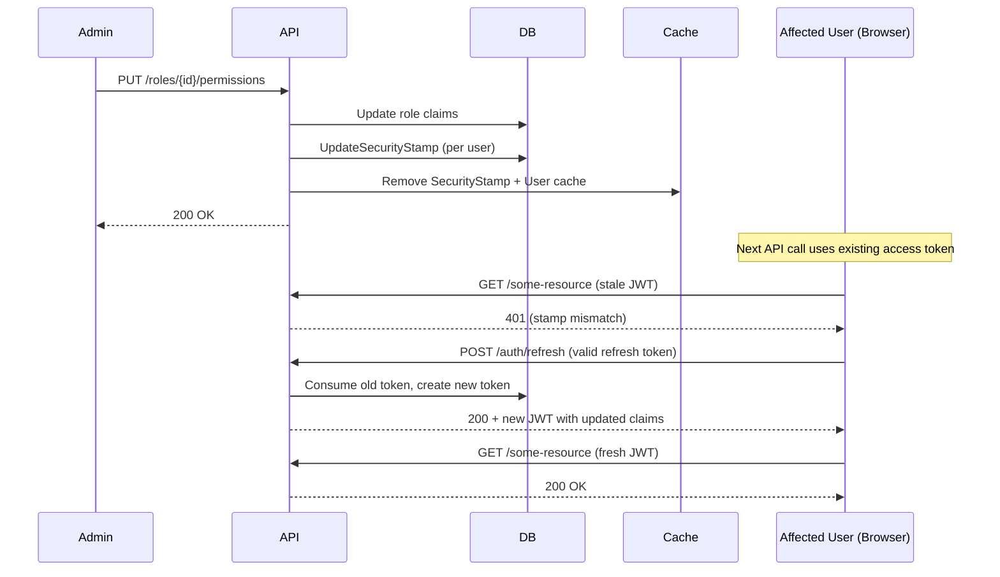

# Soft-Refresh on Permission and Role Changes

**Date**: 2026-02-14
**Scope**: Preserving refresh tokens when admin changes roles or permissions so users silently re-authenticate instead of being signed out.

## Summary

Previously, role assignment, role removal, and permission changes all revoked every refresh token for the affected user(s), forcing an immediate sign-out. This was disruptive — an admin tweaking a role's permissions could kick dozens of users out mid-session. We changed the approach: rotate the security stamp (invalidating the current access token) but leave refresh tokens intact. The frontend's existing silent-refresh logic detects the 401, calls `/api/auth/refresh`, and receives a new JWT with updated claims — no interruption.

## Changes Made

| File | Change | Reason |
|------|--------|--------|
| `src/backend/MyProject.Infrastructure/Features/Admin/Services/RoleManagementService.cs` | `RotateSecurityStampsForRoleAsync` now only rotates security stamps and clears caches — no longer revokes refresh tokens | Preserve sessions on permission changes |
| `src/backend/MyProject.Infrastructure/Features/Admin/Services/AdminService.cs` | Extracted `RotateSecurityStampAsync` helper; `AssignRoleAsync` and `RemoveRoleAsync` call it instead of `RevokeUserSessionsAsync` | Soft-refresh for role assignment/removal; DRY helper |
| `src/backend/MyProject.Infrastructure/Features/Authentication/Services/AuthenticationService.cs` | `RefreshTokenAsync` preserves `storedToken.ExpiredAt` on the new entity and cookie | Original 7-day window survives rotation; prevents indefinite session extension |

## Decisions & Reasoning

### Soft-refresh vs hard sign-out for permission changes

- **Choice**: Rotate security stamp only; keep refresh tokens alive
- **Alternatives considered**: (1) Keep the existing revoke-everything approach, (2) Push updated claims via WebSocket
- **Reasoning**: Revoking everything is heavy-handed — users lose unsaved work. WebSockets add infrastructure complexity. The existing silent-refresh path already handles 401 gracefully, so rotating the stamp is the simplest path: the access token becomes invalid immediately, and the next API call triggers a transparent refresh that mints a new JWT with the correct claims.

### Preserving original refresh token expiry on rotation

- **Choice**: Copy `ExpiredAt` from the consumed token to the new token
- **Alternatives considered**: Mint a fresh 7-day window on every rotation
- **Reasoning**: A fresh window on every rotation means a session never expires as long as the user is active — undermining the configured security boundary (set via appsettings/env, e.g. 7 days). Copying the original expiry ensures sessions still expire on schedule, and the sliding window is bounded.

### Shared `RotateSecurityStampAsync` helper in `AdminService`

- **Choice**: Extract a private helper and reuse it in `AssignRoleAsync` and `RemoveRoleAsync`
- **Alternatives considered**: Inline the two calls in each method
- **Reasoning**: Both operations have identical stamp-rotation semantics. A shared helper keeps intent clear and prevents drift if caching logic changes later.

## Diagrams

## Follow-Up Items

- [ ] Add "Remember me" login option — control whether cookies are persistent or session-scoped
