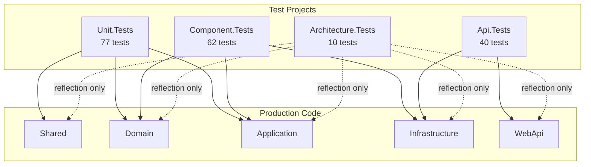
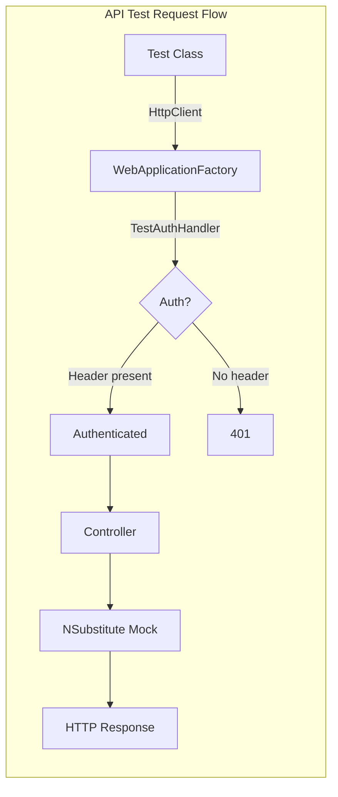

# Backend Test Suite

**Date**: 2026-02-15
**Scope**: Comprehensive backend testing infrastructure — unit, component, API integration, and architecture tests

## Summary

Added 190 backend tests across 4 test projects covering all layers of the Clean Architecture stack. Tests run in-process without external dependencies (no Docker, PostgreSQL, or Redis). CI pipeline updated to run tests on every PR.

## Changes Made

| File | Change | Reason |
|------|--------|--------|
| `src/backend/tests/MyProject.Unit.Tests/` | New project — 77 unit tests | Cover Shared (Result, ErrorMessages, PhoneNumberHelper, ErrorType), Domain (BaseEntity), and Application (AppRoles, AppPermissions) pure logic |
| `src/backend/tests/MyProject.Component.Tests/` | New project — 62 component tests | Cover AuthenticationService, AdminService, RoleManagementService, UserService business logic with mocked dependencies |
| `src/backend/tests/MyProject.Api.Tests/` | New project — 40 tests (16 controller + 24 validator) | Cover AuthController, UsersController HTTP pipeline + RegisterRequest, LoginRequest, ChangePasswordRequest validators |
| `src/backend/tests/MyProject.Architecture.Tests/` | New project — 10 tests | Enforce layer dependency rules, naming conventions, access modifiers |
| `src/backend/Directory.Packages.props` | Added test package versions | xUnit, NSubstitute, Mvc.Testing, InMemory EF, NetArchTest, TimeProvider.Testing |
| `src/backend/MyProject.slnx` | Added 4 test projects to solution | IDE and CI discovery |
| `src/backend/MyProject.WebApi/appsettings.Testing.json` | New config file | Test-specific settings that disable Redis, Hangfire, restrict CORS |
| `src/backend/.dockerignore` | Added `**/tests` | Exclude test projects from Docker build context |
| `.github/workflows/ci.yml` | Uncommented test step | Run tests in CI on every PR |
| `CLAUDE.md` | Added test command to pre-commit checks | Tests must pass before committing |
| `AGENTS.md` | Added test step to pre-commit section | Tests must pass before committing |
| `src/backend/AGENTS.md` | Replaced placeholder Testing section | Full documentation of test infrastructure, patterns, and conventions |
| `FILEMAP.md` | Added test file patterns and change impact entries | Track test file dependencies |
| `SKILLS.md` | Added testing recipes | Run tests, add unit/component/API/validator tests |

## Decisions & Reasoning

### NSubstitute over Moq

- **Choice**: NSubstitute (BSD-3-Clause)
- **Alternatives considered**: Moq, FakeItEasy
- **Reasoning**: Moq's 2023 SponsorLink incident damaged trust even though reverted. FakeItEasy (Apache 2.0) is clean but lower adoption. NSubstitute has the best combination of clean API, wide adoption, and unblemished reputation.

### Four Test Projects (not one)

- **Choice**: Separate projects for unit, component, API, and architecture tests
- **Alternatives considered**: Single test project, two projects (unit + integration)
- **Reasoning**: Each project has different dependency needs. Unit tests reference only Shared/Domain/Application (no Infrastructure). Component tests need Infrastructure internals. API tests need WebApplicationFactory. Architecture tests need all assemblies via reflection. Separation keeps dependencies minimal and test execution parallelizable.

### Manual DbContext Registration in WebApplicationFactory

- **Choice**: Manually register `DbContextOptions<MyProjectDbContext>` instead of using `AddDbContext`
- **Alternatives considered**: `RemoveAll + AddDbContext`, Testcontainers with real PostgreSQL
- **Reasoning**: `AddDbContext` uses `TryAdd` internally. When `RemoveAll + AddDbContext` is used in `ConfigureTestServices`, both Npgsql and InMemory providers end up registered, causing a dual-provider exception. Manual registration bypasses `TryAdd` entirely. Testcontainers is planned as a follow-up for true integration tests.

### PostConfigure for Auth Scheme Override

- **Choice**: `PostConfigure<AuthenticationOptions>` to override JWT Bearer defaults
- **Alternatives considered**: `AddAuthentication("Test")`, removing JWT scheme registration
- **Reasoning**: The app's `ConfigureJwtAuthentication` explicitly sets `DefaultAuthenticateScheme = JwtBearerDefaults.AuthenticationScheme`. A simple `AddAuthentication("Test")` only sets `DefaultScheme`, not `DefaultAuthenticateScheme`. `PostConfigure` runs after all `Configure` actions, ensuring the test scheme wins.

### appsettings.Testing.json

- **Choice**: Dedicated JSON config file for test environment
- **Alternatives considered**: In-memory `Dictionary<string, string?>` configuration override
- **Reasoning**: JSON file is more maintainable, easier to review, and follows ASP.NET Core's standard configuration hierarchy. Works both pre-init (template placeholders) and post-init.

## Diagrams

## Follow-Up Items

- [ ] Testcontainers integration for real PostgreSQL tests (new `MyProject.Integration.Tests` project)
- [x] AdminController integration tests (requires mocking `IAdminService`)
- [x] JobsController integration tests (requires mocking `IJobManagementService`)
- [ ] BaseEntityRepository tests with InMemory provider (CRUD, soft-delete, pagination)
- [ ] Code coverage reporting (coverlet + reportgenerator)
