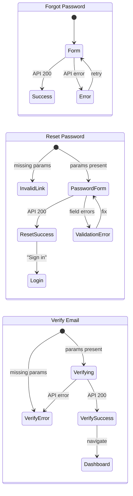

# Frontend: Forgot Password, Reset Password, Email Verification

**Date**: 2026-02-15
**Scope**: Frontend pages and components for forgot-password, reset-password, email verification, and verification banner

## Summary

Implemented the frontend counterpart to backend PR #183. Added three new public pages (forgot-password, reset-password, verify-email), an email verification banner for the app layout, and ~35 i18n keys in English and Czech. All components follow existing codebase patterns (LoginForm, ChangePasswordForm) with rate limiting, error handling, and accessibility.

## Changes Made

| File | Change | Reason |
|------|--------|--------|
| `src/frontend/src/lib/components/auth/ForgotPasswordForm.svelte` | New component | Email form with anti-enumeration success message |
| `src/frontend/src/lib/components/auth/ResetPasswordForm.svelte` | New component | Password + confirm form with field-level shakes |
| `src/frontend/src/lib/components/auth/EmailVerificationBanner.svelte` | New component | Dismissible warning bar with resend + cooldown |
| `src/frontend/src/routes/(public)/forgot-password/+page.server.ts` | New route | Redirect authenticated users |
| `src/frontend/src/routes/(public)/forgot-password/+page.svelte` | New page | Thin wrapper rendering ForgotPasswordForm |
| `src/frontend/src/routes/(public)/reset-password/+page.server.ts` | New route | Extract email+token from query params, redirect auth |
| `src/frontend/src/routes/(public)/reset-password/+page.svelte` | New page | Passes data to ResetPasswordForm |
| `src/frontend/src/routes/(public)/verify-email/+page.server.ts` | New route | Extract email+token, no auth redirect (intentional) |
| `src/frontend/src/routes/(public)/verify-email/+page.svelte` | New page | Auto-verify on mount, three states |
| `src/frontend/src/lib/components/auth/LoginForm.svelte` | Added forgot password link | "Forgot password?" between password label and input |
| `src/frontend/src/lib/components/auth/index.ts` | Added exports | ForgotPasswordForm, ResetPasswordForm, EmailVerificationBanner |
| `src/frontend/src/lib/api/error-handling.ts` | Added Token field map | `Token: 'token'` in DEFAULT_FIELD_MAP |
| `src/frontend/src/routes/(app)/+layout.svelte` | Added banner | Show EmailVerificationBanner when !emailConfirmed |
| `src/frontend/src/messages/en.json` | Added ~35 keys | Forgot password, reset password, verify email, banner |
| `src/frontend/src/messages/cs.json` | Added ~35 keys | Czech translations for all new keys |
| `src/frontend/src/lib/api/v1.d.ts` | Regenerated | Types for new backend auth endpoints |

## Decisions & Reasoning

### onMount vs $effect for verify-email auto-submission

- **Choice**: `onMount` for one-shot verification on page load
- **Alternatives considered**: `$effect` (initial implementation)
- **Reasoning**: `$effect` would re-trigger after `invalidateAll()` refreshes page data, causing a redundant API call. `onMount` correctly runs once, matching the semantic intent of "verify on arrival".

### verify-email in (public) route group without auth redirect

- **Choice**: No auth redirect on verify-email page
- **Alternatives considered**: Placing in (app) group or adding auth redirect
- **Reasoning**: User clicking verification link may or may not be logged in. The page must work in both states. On success, `invalidateAll()` refreshes layout data so the banner disappears for logged-in users.

### All i18n keys in first commit

- **Choice**: Added all i18n keys (forgot, reset, verify, banner) in the first commit
- **Alternatives considered**: Splitting keys across commits matching their components
- **Reasoning**: JSON files can't be partially staged, and unused keys are harmless. Component exports were staged incrementally as files were created.

## Diagrams

## Follow-Up Items

- [ ] Backend: explicitly configure `DataProtectionTokenProviderOptions.TokenLifespan` (currently implicit 24h default)
- [ ] Backend: HTML-encode reset/verification URL in email body for defense in depth
- [ ] Backend: replace `null!` on `user.Email!` in `SendVerificationEmailAsync` with guard clause
- [ ] Backend: add missing API test `ResetPassword_MissingEmail_Returns400`
- [ ] Backend: improve email expiry wording to state actual duration
