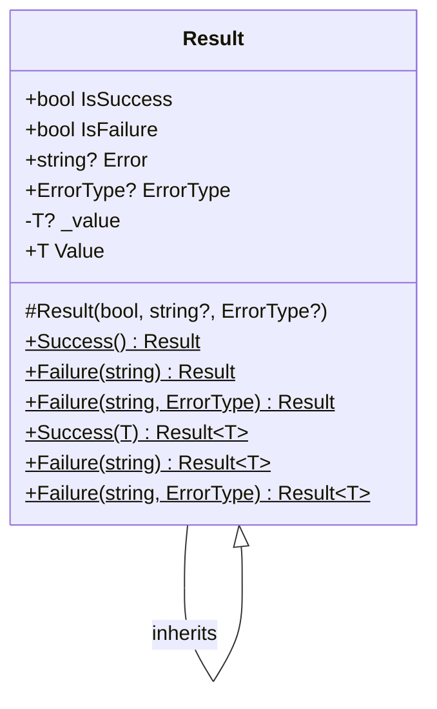

# Result Inheritance & Shared Layer Extraction

**Date**: 2026-02-15
**Scope**: Refactor Result pattern with inheritance, extract Shared project, add ProblemFactory

## Summary

Extracted cross-cutting plumbing (`Result`, `ErrorType`, `ErrorMessages`, `PhoneNumberHelper`) from Domain into a new `MyProject.Shared` project. Made `Result<T>` inherit from `Result` to eliminate property duplication, added `IsFailure`, and made `Value` throw on failure access — removing all `null!` usage from controllers. Centralized error-to-ProblemDetails mapping in `ProblemFactory.Create()`.

## Changes Made

| File | Change | Reason |
|------|--------|--------|
| `src/backend/MyProject.Shared/` | New project with `Result.cs`, `ErrorType.cs`, `ErrorMessages.cs`, `PhoneNumberHelper.cs` | Separate cross-cutting plumbing from business domain |
| `src/backend/MyProject.Shared/Result.cs` | `Result<T> : Result` inheritance, `IsFailure`, throwing `Value` | Eliminate duplication, enforce safe access |
| `src/backend/MyProject.Domain/Result.cs` | Deleted | Moved to Shared |
| `src/backend/MyProject.Domain/ErrorMessages.cs` | Deleted | Moved to Shared |
| `src/backend/MyProject.Domain/PhoneNumberHelper.cs` | Deleted | Moved to Shared |
| `src/backend/MyProject.WebApi/Shared/ProblemFactory.cs` | New static factory | Centralize Result → ProblemDetails mapping |
| `src/backend/MyProject.WebApi/Features/Admin/AdminController.cs` | `result.Value!` → `result.Value`, use ProblemFactory | Remove null!, use centralized error mapping |
| `src/backend/MyProject.WebApi/Features/Admin/JobsController.cs` | Same as above | Same |
| `src/backend/MyProject.WebApi/Features/Authentication/AuthController.cs` | Same as above | Same |
| `src/backend/MyProject.WebApi/Features/Users/UsersController.cs` | Same as above | Same |
| `src/backend/AGENTS.md` | Updated Result Pattern section | Document inheritance, IsFailure, throwing Value |
| `AGENTS.md`, `CLAUDE.md`, `FILEMAP.md`, `SKILLS.md` | Updated references to Shared layer | Reflect new project structure |

## Decisions & Reasoning

### Result<T> inherits Result (class, not struct)

- **Choice**: Class-based inheritance
- **Alternatives considered**: Struct-based Result, interface-based composition
- **Reasoning**: Structs can't inherit; all results flow through `Task<Result<T>>` which heap-allocates anyway; class inheritance cleanly eliminates property duplication

### Value throws InvalidOperationException on failure

- **Choice**: Throwing property guarded by `IsSuccess`
- **Alternatives considered**: Keep nullable `T? Value`, use `GetValueOrThrow()` method
- **Reasoning**: Matches `Nullable<T>.Value` semantics in .NET runtime; single internal `_value!` is sound when guarded by `IsSuccess`; eliminates 7 `null!` violations in controllers

### Shared project instead of Domain

- **Choice**: New `MyProject.Shared` project for `Result`, `ErrorType`, `ErrorMessages`, `PhoneNumberHelper`
- **Alternatives considered**: Keep in Domain
- **Reasoning**: These are infrastructure plumbing, not business domain concepts; Domain should contain only entities and value objects

## Diagrams

## Follow-Up Items

- [ ] Add unit tests for `Result<T>.Value` throwing on failure access
- [ ] Add unit tests for `ProblemFactory.Create()` status code mapping
